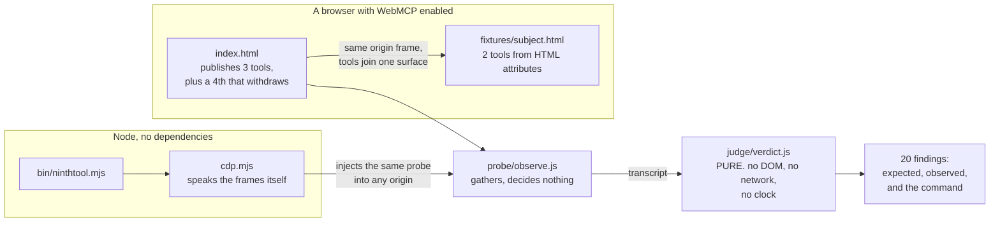
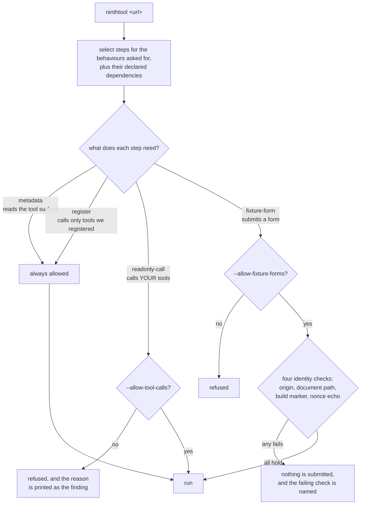

# Ninth Tool

**Ninth Tool executes your page's WebMCP tools in the browser and shows which promises the browser
silently drops, with the command that reproduces each one.**

Named for the tool that has to disappear. A conditional tool appears when the state that justifies
it appears, and it is supposed to withdraw when that state goes away. Write the withdrawal the
obvious way, with the abort signal on the descriptor rather than in the options bag, and it never
happens, and nothing is thrown.

[](https://github.com/upgradedev/ninthtool/actions/workflows/ci.yml)
[](https://github.com/upgradedev/ninthtool/actions/workflows/readiness.yml)
[](LICENSE)

**Live, no account, no install: <https://upgradedev.github.io/ninthtool/>**
It needs a Chromium browser with WebMCP enabled at `chrome://flags/#enable-webmcp-testing`. On any
other browser the page still renders every row and what was measured, and says why it cannot run.

Also here: [the prior art search](docs/prior-art.md) that killed this project's first design, and
[every measurement with the command that produced it](docs/evidence.md).

---

## Contents

- [It is a WebMCP page as well as a WebMCP auditor](#it-is-a-webmcp-page-as-well-as-a-webmcp-auditor)
- [What this is](#what-this-is)
- [How it fits together](#how-it-fits-together)
- [Your page](#your-page), the six rows you can fix
- [The host](#the-host), the fourteen that are the same wherever you point it
- [How it decides](#how-it-decides)
- [What it is allowed to touch](#what-it-is-allowed-to-touch)
- [Run it](#run-it)
- [Run the checks](#run-the-checks)
- [The readiness gate](#the-readiness-gate)
- [Relationship to our other entry](#relationship-to-our-other-entry-and-what-was-reused)
- [What it does not do](#what-it-does-not-do)
- [Evidence](#evidence)

---

## It is a WebMCP page as well as a WebMCP auditor

Both halves of the standard, on one surface. The auditor publishes tools of its own, so a visitor's
agent runs the whole audit without touching the screen, and the subject page it drives publishes two
more from nothing but HTML attributes.

| Tool | What it does | `readOnlyHint` |
|---|---|---|
| `nt_list_behaviours` | every behaviour this suite tests, filterable by group | `true` |
| `nt_explain_behaviour` | one row in full: the promise, the specification, what was measured, the command | `true` |
| `nt_run_audit` | runs the audit and returns the counts. **Marked not read only**, because it drives forms on the subject page, and saying otherwise would be exactly the dishonest annotation this suite exists to catch | `false` |
| `nt_get_findings` | reads the findings from the run. **Does not exist until an audit has produced some, and is withdrawn when they are cleared** | `true` |

`nt_get_findings` is registered with the abort signal in the options bag, which is the only place
that works, and behaviour C2 below exists because putting it on the descriptor fails silently. The
tool count on the page moves from three to four and back, so the behaviour this project is named
after is visible rather than described.

**On the name.** It is named after the behaviour, not after a position in this page's tool list. A
conditional tool is one that appears when the state justifying it appears and has to disappear when
that state goes away, and the eight-then-nine-then-eight shape is how anyone first meets the
problem. An earlier version of this file called `nt_get_findings` "the ninth tool", which was simply
wrong arithmetic: it is the fourth tool this page registers and the sixth on the aggregate surface a
flagged Chrome sees. The count was never the point. The withdrawal is.

Every one of them validates its own arguments, because behaviour C3 measured that the browser
validates none, and every one refuses by returning a result rather than throwing, because behaviour
B1 measured that throwing erases the message.

---

## What this is

Not a website scanner. Several of those already exist and they read a page's declared metadata:
names, descriptions, schemas. This one **calls the tools and watches what happens**, because the
measurements below say that is where the defects are. A page can pass every metadata linter, look
correct in a tool inspector, and still tell an agent that a write succeeded when it was refused.

**13 of the 20 rows cannot be decided by reading a tool list.** They need a tool to be called, or
one of our own to be registered and watched. The other seven are readable from `getTools()` and are
the ones an existing checker already reaches. Of the six rows about your own page, four are metadata
and two need execution.

Recount it yourself, from the catalogue rather than from this sentence:

```bash
node -e "import('./src/judge/behaviours.js').then(m=>console.log(m.decidability()))"
```

That is the only comparative number here, and it is narrow on purpose. It is a property of these
twenty rows, not a survey, not a benchmark against a named product, and not a claim about how well
anybody implements the metadata half. A different catalogue would score differently.
`tests/unit/decidability.test.js` asserts the classification row by row, so it cannot be quietly
adjusted to flatter the number.

Twenty behaviours. **Six read the tools your page publishes and are the ones you can fix.** The
other fourteen are the host, and are the same wherever you point this. They are not all the same
kind of thing, and they are not all defects: three are divergences from the specification, five are
gaps the standard cannot express, three are traps that fail silently, one is deliberate design with
a gap around it, and two hold. Every row carries one command that reproduces it.

## How it fits together

Two front ends, one judge. The judge cannot reach a browser at all, which is what makes a stored
verdict checkable by somebody who does not trust us.



The two paths meet at the transcript, so a verdict from the page and a verdict from the command line
are the same kind of thing and can be compared. Readiness row M8 does exactly that: it fetches the
raw transcript from the live page, judges it here, and fails if the page's own rendering disagrees.

## What it is allowed to touch

Every step declares a mode, and the runner refuses a mode it was not authorised for **before a
browser is launched**. This exists because an audit pointed the runner at a page that merely used
the same tool name as the bundled fixture and watched two forms get submitted on it.



With no URL the target is the subject page this repository ships and serves itself, so both
authorisations are on. With a URL, neither is, unless asked for by name.


## Your page

These read the tool surface as it was **before this probe registered anything of its own**, so a
failure here is a defect a page author can act on today. This is the group a build should go red on,
which is what `--fail-on page` does.

| # | The row | What it catches |
|---|---|---|
| P1 | every tool you publish says whether it writes | a tool with no `readOnlyHint` is one an agent has to guess about, and the safe guess is not to call it |
| P2 | every tool declares a schema an agent can read | a missing or unparseable schema, in a standard where the browser validates nothing on the script path |
| P3 | every tool and every parameter is described | an undescribed parameter is one a model fills with something plausible |
| P4 | nothing on your surface came from a frame you may not control | anything you embed same origin can put a tool in front of an agent on your page, under your origin |
| P5 | your read only tools **demonstrably refuse** a call that breaks their own required list | the browser ignores `required`, so the promise is yours to keep. Passes only on a rejection; an identical answer proves a defect; anything else is reported as inconclusive |
| P6 | calling one read only tool does not change what another one answers | a narrow differential, with a stability control first. It **cannot** prove `readOnlyHint` is honest and does not claim to |

**This page fails two of its own six and abstains on a third, and owns all three.** P1 fails because two of its tools come from
HTML forms and the standard has no way to annotate those at all, which is behaviour B4 below. P4
fails because this page and its subject frame share one origin, so they share one tool surface:
whichever document you measure from, the other one's tools are on it and nothing says where they
came from. That is the finding, not an accident.

**P5 abstains here, and it is the most interesting row.** It passes only on a demonstrated refusal,
and the only refusal signal WebMCP has is rejecting the promise, which B1 measured erases the page's
own reason. The tools on this page deliberately do the other thing: they return a result carrying
the reason so a caller can read it. That choice cannot be verified from outside, so the row reports
that nothing was demonstrated rather than passing on a guess. The standard makes you choose between
a readable refusal and a detectable one, and this suite can only confirm the second.

P5 has been wrong twice and both corrections are in the catalogue. It first sent a property that was
in no schema, which JSON Schema permits. It then passed on "answered differently", which is equally
consistent with the tool echoing its arguments, so it could pass with nothing shown. Three outcomes
now, and only a rejection is a pass.

## The host

Fourteen rows that are the same whatever page you point this at, and they are five different kinds
of thing.

An earlier draft reported one number: "the browser ignores six of these". That was an overstatement.
Three of the six were never the browser failing to implement anything, they were fields that do not
exist in WebMCP at all. A reader who checked one row and found it was not a browser defect would
have been right to discount the rest. So they are separate claims, each defensible on its own terms.

### The browser diverges from the specification it implements

| # | The contract | Chrome 152.0.7977.65 |
|---|---|---|
| A1 | `callback ToolExecuteCallback = Promise<any> (object inputObject, ToolExecuteCallbackOptions options)`, with a required `AbortSignal`, in the [W3C draft](https://webmachinelearning.github.io/webmcp/) and in Chromium IDL | the callback gets **one argument**. `options` is `undefined`, so `execute(args, {signal})` throws |
| A2 | `RegisteredTool.inputSchema` is `object` in the W3C draft | a **JSON string**. Code written to the draft reads `.type` and gets `undefined` |
| A3 | `consequentialHint` is in current Chromium IDL | **absent** from this build |

### The standard provides no way to do it

The [W3C draft](https://webmachinelearning.github.io/webmcp/) flags the first of these itself:
*"Support more granular errors than “UnknownError”, based on each failure case."* Five of the twenty
rows measure the declarative half, whose section in that draft currently reads, in full:
*"This section is entirely a TODO. For now, refer to the Declarative API explainer"*. This suite is
what probing that half looks like while it is being written.

| # | What a page needs to do | WebMCP today |
|---|---|---|
| B1 | **signal a failure and say why in one answer** | no route does both. `{ isError: true }` **resolves**, so the reason is readable in the payload but the promise carries no failure signal. Rejecting flattens every error, a named `DOMException` included, to `UnknownError`, and the reason is gone |
| B2 | mark a result as failed in band | `isError` is ordinary payload. The promise still resolves and the agent reads success |
| B3 | warn that a tool is destructive | no such field. `destructiveHint`, `idempotentHint` and `openWorldHint` are backend MCP's and vanish silently |
| B4 | annotate a declarative tool | form derived tools carry **no annotations at all**, not even `readOnlyHint` |
| B5 | tell the caller whether to parse the result | none. A string comes back raw, an object comes back as JSON, nothing distinguishes them |

### It works, but the obvious way to write it fails silently

| # | Trap | What happens |
|---|---|---|
| C1 | a missing required property is **not refused, it is filled from the control's stale value** | a call omitting a required property resolved, and the handler was handed the name left in the DOM by the previous, unrelated call |
| C2 | withdrawal only works via `registerTool(desc, { signal })` | `signal` on the descriptor registers a tool that can never withdraw, and throws nothing |
| C3 | validation depends on which half registered the tool | script registered enforces **nothing it declares**; the form half enforces the declared type and enum but **not `required`**, so no declared constraint is enforced on both paths. Read with C1: the form path decides `required` from the **control**, not the call, so what a previous call left in the DOM changes the answer. The run prints the per constraint split; this table does not carry counts, because a count typed here cannot track a browser that moves |

### Deliberate, and the gap around it

| # | The behaviour | What is actually reported |
|---|---|---|
| C4 | a declarative form without `toolautosubmit` fills the controls and waits for a person | **the pause is the design**, not a defect, and this row does not call it one. What it reports is that nothing on the surface distinguishes a tool that will answer from one waiting for a human. Same shape, same schema, no annotation. An agent finds out by waiting, with no deadline to wait against |

An earlier version of this file counted C4 as a broken promise. It is somebody's deliberate
human-in-the-loop design, and counting it inflated the headline. A taxonomy that calls every
observation the same kind of thing cannot be trusted on any single row.

### And two that hold

`toolchange` fires on both registration and withdrawal, so the surface is observable without
polling. Form derived schemas are built richly from markup, including `enum` from a `<select>` and
`minimum` and `maximum` from a number input. A suite that only ever prints failures cannot be
trusted to notice a pass, so these are reported too.

## How it decides

One pure module, `src/judge/verdict.js`. A transcript goes in, a verdict comes out. It has no way to
reach a browser, no clock and no network, so the same transcript always produces the same verdict
and a stored result is checkable by a reader who does not trust us.

Gathering and judging are separate on purpose. The probe this grew from used to print what it saw
and exit zero whatever that was, so pointed at a browser with no WebMCP it printed `api: null` and
reported success. A run that proved nothing looked exactly like a run that proved everything.

**Every rule is broken once, on purpose.** `tests/unit/verdict_mutations.test.js` starts from a
transcript that passes everything, changes one field, and requires that behaviour to stop passing,
for all twenty. Stopping passing is not always turning red: a row can move to an abstention, and
that still proves the rule reads the field. A structural assertion in that file fails the build if a
behaviour is added to the catalogue without a mutation proving its rule can fail.

## Run it

**With no checkout at all.** One line, against a page of your own:

```bash
npx --yes https://github.com/upgradedev/ninthtool/tarball/main https://your-page.example
```

It has no dependencies, so there is nothing to resolve and nothing to audit before it runs. Node 20
or later, and a Chromium browser with WebMCP enabled.

That is the tarball URL rather than the tidier `npx github:upgradedev/ninthtool`, and the reason is
measured rather than stylistic: on npm 10.8.2 the shorthand fails with
`GitFetcher requires an Arborist constructor to pack a tarball`. The end to end job tries the
shorthand first on every run, so the day npm fixes it this README gets shorter.

**The CI end to end job runs this exact line on a clean machine with no checkout**, and asserts the
help text is the shipped one, that a bad `--fail-on` still exits 2 before launching anything, and
that `--behaviour A1` reports one behaviour tested. The command here has been executed rather than
written down.

From a checkout, with no arguments and no separate terminal. It starts a loopback server, launches
your Chrome with the feature enabled in a throwaway profile, drives this page and prints the report.
It audits the page itself rather than the subject frame, because same origin frames contribute their
tools to the top document, so from there both halves of the standard are on one surface at once:

```bash
node bin/ninthtool.mjs
```

Against a page of your own, on any origin:

```bash
node bin/ninthtool.mjs https://your-page.example
```

One behaviour only, which is what every `reproduce` line in the report gives you:

```bash
node bin/ninthtool.mjs --behaviour B1
```

In a build, where a defect in your page should stop the run. A broken promise is the expected
finding of this instrument rather than an error in running it, so the exit code is zero by default
whenever the run completed, and `--fail-on` is how you ask for the other behaviour:

```bash
node bin/ninthtool.mjs https://your-page.example --fail-on page
```

### Every flag, and where to get today's list

`--help` is the shipped list and is what a test asserts against. It carries eight:

| flag | what it does |
|---|---|
| `--behaviour ID`, `-b` | run one row, for example `B1` or `C2` |
| `--fail-on WHAT` | exit non zero on `page` or on `any` |
| `--json` | print the verdict as JSON instead of a report |
| `--port N` | the remote debugging port, default 9411 |
| `--chrome PATH` | the Chrome or Edge binary, found automatically if omitted |
| `--keep-open` | leave the browser, its profile and the local server running afterwards |
| `--allow-tool-calls` | let it CALL tools the page marked `readOnlyHint`. Rows P5 and P6 need this |
| `--allow-fixture-forms` | let it SUBMIT a form, which is a write. Rows C1, C3 and C4 need this |

The two `--allow` flags are the only ones that widen what this tool may touch, and neither is on by
default against a page you name. Run `node bin/ninthtool.mjs --help` for the version in your
checkout rather than trusting this table.

`--fail-on page` exits 1 on any of the six your-page rows failing, and ignores the fourteen host
rows, because your build should not go red over something Chrome does to everybody. `--fail-on any`
exits 1 on anything. An incomplete run exits 3, because a behaviour that was never observed is not
a behaviour that passed. The one exception is `--keep-open`, which never exits on its own, and
whose exit code tells you how the run was stopped rather than what it found.

The probe **calls only tools your page has marked `readOnlyHint`**. A tool carrying no annotations is
never called, and that refusal is reported as a finding, because a page that gives an auditor no way
to know a tool is safe gives an agent no way either. THREE rows submit a form, which is a write:
C1, C3 and C4. They run only against a fixture this runner owns, meaning one it served itself or the
document it is executing inside, because every other signal a page exposes here is copyable.

## Run the checks

```bash
node --test tests/unit
```

```bash
node scripts/check_style.mjs --selftest
```

```bash
node scripts/readiness.mjs
```

No dependencies, no lock file, nothing to install. Node 20 or later, and a Chromium browser for the
runner. Firefox and Safari have no WebMCP implementation, so there is nothing for this to measure
there.

## The readiness gate

Fourteen automated rows and four the owner has to close. It answers one question: could a stranger
with no account reach every mandatory artifact right now?

**It fetches the live URL and fails on anything but 200**, checks every asset that page needs, greps
the **deployed bytes** rather than the source for the tools this README claims, and then opens the
live origin in a real browser and presses the button a visitor presses. That last row asserts the
audit judged all twenty behaviours, that the only row allowed to abstain is the one named in the
config, currently P5, and that the conditional tool both appeared and withdrew. A numeric allowance
was there before, and a named list is stricter: a second unsettled row now fails the gate where a
floor of two accepted it.

A file existence check and a regular expression over the source prove that something was written,
not that anything is deployed. A gate elsewhere once stayed green through a two day outage because
every check read the repository.

Three things it will not do:

- **A row that could not be run is not a pass.** It stays in the denominator, so skipping the
  browser row drops the score to 93 percent and the gate exits 1. A gate that shrinks its own
  denominator reports a higher score for doing less.
- **Owner gated is a third status.** The four rows only a person can close are printed separately
  with their exact manual step and never counted as credit.
- **A threshold cannot be moved quietly.** Each number is pinned in `scripts/readiness_config.mjs`,
  again in the fixture beside it, and again in `tests/unit/readiness_thresholds.test.js`. The gate
  compares the first two before running anything and exits 2 with the disagreement named.

Every row has been watched failing, two ways. `--selftest` feeds each row's judgement a
deliberately wrong input and requires it to go red, which proves the judgement rather than the
plumbing. The plumbing was proved separately, and more strongly, by pointing the config at an origin
that does not exist: M4 through M7 and R5 went red through their real checks, the browser row could
not reach a live origin at all, and the run fell to 57 percent. That is eight of the fourteen
automated rows, which is six red against the five this sentence used to name; M8 is the sixth, and
it was missing from the list rather than from the run.

## The console is not silent during a run, on purpose

Behaviour B1 asks whether a refusal can reach the caller, and the only way to ask is to throw inside
a tool handler and to reject with a `DOMException`. Chrome logs both. So an audit leaves four
entries in the console that read like errors and are the instrument doing its job. They appear only
while the audit runs, they come from tools this suite registered and withdrew, and the page is quiet
before and after.

## Relationship to our other entry, and what was reused

The same author has a second entry in this hackathon, **ClaimReady**. The rules allow more than one
submission provided each is unique and substantially different, and whether these two are is the
Sponsor's and Devpost's call, not ours. What follows is the material they would need to make it.

|  | ClaimReady | Ninth Tool |
|---|---|---|
| Who uses it | a person making an insurance claim, and their agent | a developer who ships a WebMCP page |
| What it does | first notice of loss on an insurer's page: policy rules, requirements, a filed claim | runs a behavioural probe catalogue against a WebMCP tool surface |
| The workflow | fill a claim draft, satisfy insurer requirements, file it | point it at a page, read which of its promises hold |
| The interface | a claim desk | a report, and a command line runner |
| The value | the claim is right before it is filed | the page does not lie to an agent |
| Domain code | insurance policy, coverage, excess, requirements | none |

**Exactly one file was reused.** `src/probe/cdp.mjs`, a dependency free Chrome DevTools Protocol
client of about 200 lines, copied from ClaimReady's `evidence/impact/page_client.mjs` at commit
`2d7a6098236b5a78092307423d3a7731251f58c1`. It was modified here: the docblock was rewritten to record the reuse, and `openSession` gained
an optional target matcher after a run attached to `about:blank` and measured nothing.

**What was not reused:** no ClaimReady user interface, no styling, no domain logic, no policy or
coverage or claim model, no fixtures, no evidence, no copy, no assets, and no tests. The catalogue,
the judge, the mutation suite, the probe, the step table, the fixture identity checks, the subject
page, this page, its tools, the runner, the launcher, the style gate, the readiness gate and every
test are new to this repository, whose first commit is 2026-09-01.

The two entries share one motif, the conditional tool that has to withdraw, because both were built
against the same standard and that is the behaviour the standard makes hardest to get right. They
share no code that expresses it.

## What it does not do

- **It does not scan other people's sites.** A page cannot reach another origin's tool surface. The
  `tools` Permissions Policy defaults to `self`, and a cross origin iframe was measured
  contributing zero tools. That boundary is why this is shaped as a suite you run against your own
  page rather than a scanner you point at a stranger's.
- **It will not submit a form to a page it cannot prove it owns, and the proof happens first.**
  Three of the four identity checks, the tool name, the pathname and the build marker, are copyable
  from this public repository. The fourth, a per run nonce the fixture's own handler echoes, is not,
  but reading it back requires calling the tool, and for a form that call IS the submission.
  Measured against a page that copied the marker and never read the nonce: it was trusted, and one
  form was submitted. There is no ordering that repairs that, because WebMCP exposes no challenge a
  document must answer before it is invoked. So the declarative rows run only against a fixture this
  runner owns, one it served itself or the document it is executing inside, and against anything
  else they refuse and report why.
- **On a page that is not ours it calls only tools marked `readOnlyHint`.** Here, where the subject
  page ships with this repository, some rows drive its forms too, because that is the only way to
  measure the declarative half at all. Nothing leaves the browser either way.
- **It is not invisible, and it no longer claims to be.** Registering a tool is a document level
  event, so a page with a `toolchange` listener sees every probe tool arrive and leave. Measured
  against a page that counts them: **26 events on a default run with nothing authorised**. If that
  listener writes, fetches or re-renders, it will do that. There is no way to register a tool in a
  document without the document being able to notice, so this is stated rather than fixed. The
  command line help used to say the default run "touches nothing belonging to the page under test",
  which was true of its tools and its forms and not true of its listeners.
- No account, no backend, no database, no crawling.
- No page is named as defective. The impact study under `evidence/impact/` does name the pages it
  ran and publishes what this tool reported on each, because a study that hid its population would
  not be one. Two of those reports were checked against the pages' own source and retracted as
  defects in THIS tool, with the handler lines cited, in the same generated file.

## Evidence

Every `measured` value in `src/judge/behaviours.js` was taken on 2026-09-01 against
**Chrome 152.0.7977.65** launched with `--enable-features=WebMCP`. Nothing in that file is copied
from documentation. Where the documentation disagrees with the measurement, the row says what the
documentation promised and is reported as a divergence.

`tests/support/transcripts.mjs` holds the transcript that browser actually produced, transcribed
rather than summarised, so the thirteen failures, five passes, one by-design row and one
inconclusive row reproduce from a checkout without a browser at all.

### The demo video is frozen at an earlier commit, and two numbers have moved since

The video was recorded against `ea29ab94`, which is what its `frozenSha` records and what the
footage shows. Two figures it speaks were true then and are not true now:

| The video says | Measured on this tree |
|---|---|
| line coverage ninety seven point eight | **98.51**, each file counted once, across 54 files |
| four files below the floor | **three**: `scripts/readiness.mjs`, `tests/unit/profile_cleanup.test.js`, `tests/unit/modules_parse.test.js` |

Both moved for the same reason: `tests/unit/reproduce_runnable.test.js` was added afterwards, to
close a defect where six rows printed a command a reader could not run. The video was not recut, so
this table is the correction. Reproduce either number with:

```
node --experimental-test-coverage --test tests/unit | tee coverage.txt
node tests/unit/coverage_gate.mjs coverage.txt --per-file --threshold=85
```

`frozenSha` was deliberately left pointing at `ea29ab94` rather than re-stamped, because moving it
would claim the footage shows code it does not.

## Licence

MIT. See [LICENSE](LICENSE).
